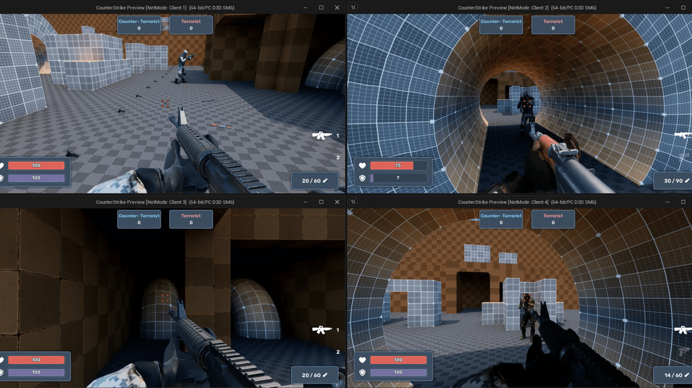

# Unreal Engine Counter-Strike Style Multiplayer FPS Game

## 프로젝트 개요
Counter-Strike 스타일의 멀티플레이어 FPS 게임으로, 팀 기반 전투 메커니즘과 네트워크 동기화 시스템을 구현했습니다. 캐릭터 이동, 무기 시스템, 전투 메커니즘 및 팀 기반 점수 시스템을 포함하여 멀티플레이어 환경에서 실시간 상호작용을 최적화했습니다.

---
## 프로젝트 요약
**프로젝트 기간**: 2024년 2월 - 2024년 4월  
**플랫폼**: PC  
**엔진**: Unreal Engine  
**도구**: Git, C++  

[Multiplayer FPS 플레이 영상](https://tv.kakao.com/v/446173331)

<!-- 
### GitHub 링크
[Unreal Multiplay FPS](https://github.com/SeoBYP/Unreal_Multiplay_FPS) -->

---

## 구현 상세

### 캐릭터 이동 및 애니메이션 동기화
- **캐릭터 이동 동기화**: `CharacterMovementComponent`의 네트워크 리플리케이션 기능을 통해 캐릭터의 이동과 속도를 서버에서 관리하고 클라이언트에 실시간으로 전송하여 일관된 이동을 제공합니다. 이를 통해 네트워크 지연 없이 부드러운 이동이 구현됩니다.
- **애니메이션 상태 동기화**: 캐릭터의 이동, 점프, 구부리기, 걷기 등의 동작은 `Animation Blueprint`와 `Blendspace`를 통해 제어되며, `RepNotify`를 사용하여 클라이언트가 서버의 상태를 반영하게 했습니다. 점프와 같은 특정 동작은 서버에서 승인 후 동기화하여 모든 클라이언트가 동일한 애니메이션을 동시에 보게 합니다.
- **예측 및 보정(Prediction and Reconciliation)**: 클라이언트 측에서 예측 위치를 계산해 이동을 로컬에 반영하고, 서버와 비교해 불일치 시 위치를 자동 보정하여 지연 없이 부드러운 움직임을 유지했습니다.

### 무기 시스템 및 전투 메커니즘
- **무기 장착 및 교체 동기화**: 무기 장착, 교체, 드롭, 탄약 관리 등 무기 시스템을 `Server RPC`와 `Multicast RPC`를 통해 구현했습니다. 무기 상태는 서버에서 관리되며, 모든 클라이언트에 동기화되어 전투 중 무기의 일관성을 유지했습니다.
- **사격 및 재장전 애니메이션**: 각 무기의 사격과 재장전 동작은 `Server RPC`로 서버에서 승인 후 `Multicast`로 동기화되어 모든 클라이언트에서 동시 실행되도록 했습니다. 탄약 수와 같은 변수는 서버에서 관리하며, 무기 상태가 클라이언트에 정확히 반영됩니다.
- **Bullet FX 및 무기 사운드**: 무기 발사 및 피격 효과는 `Multicast RPC`로 모든 클라이언트에 전달되어 실제적인 전투 몰입감을 제공합니다. Bullet FX는 서버에서 시작 위치와 방향을 설정해 클라이언트가 동일한 궤적과 사운드를 경험하도록 구현했습니다.
- **플레이어 상태 관리**: 체력과 방어력, 데미지 시스템은 서버에서 계산되며, `Replicated` 변수로 동기화되어 각 클라이언트에서 정확하게 반영됩니다. 클라이언트는 피격 시 변경된 체력 수치를 실시간으로 업데이트합니다.

### 팀 점수 및 게임 상태 관리
- **팀 점수 시스템**: 서버에서 중앙 관리되는 팀 점수 시스템으로, 팀이 MaxScore에 도달하면 자동으로 `Multicast RPC`로 게임 상태가 갱신됩니다. 이를 통해 클라이언트가 승패 상태를 동시에 공유하게 했습니다.
- **사망 및 리스폰 메커니즘**: 플레이어 사망 시 서버에서 사망 상태를 관리하고 일정 시간이 지나면 `Multicast RPC`로 리스폰 위치와 상태가 클라이언트에 동기화됩니다. 리스폰 지연 타이머를 설정하여 게임의 흐름을 원활하게 유지했습니다.

### 네트워크 통신 및 동기화 구현
- **Unreal 네트워크 리플리케이션**: Unreal Engine의 리플리케이션 기능을 사용해 주요 상호작용을 `Server RPC`와 `Multicast RPC`로 구분하여 서버 부하를 줄이고 클라이언트 응답성을 높였습니다. 주요 데이터는 `Replicated` 변수로 설정하여 모든 클라이언트가 일관된 게임 상태를 유지하도록 했습니다.
